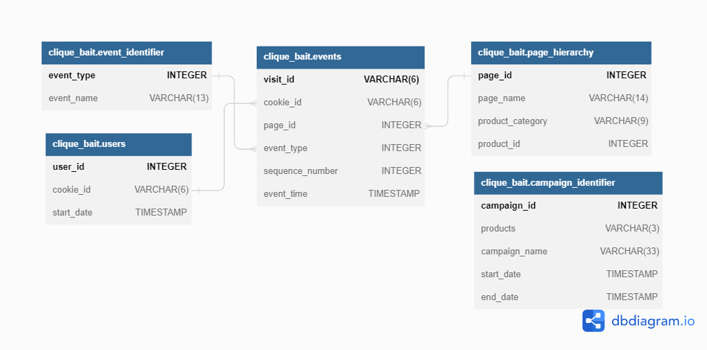

# Case Study #6 - Clique Bait

## A. Enterprise Relationship Diagram


In case the above embedded diagram doesn't load, check out the ERP.png file.

## B. Digital Analysis

1. How many users are there?
```sql
SELECT COUNT(DISTINCT(user_id)) as user_count from users;
```
| user_count      |
| --------------- |
| 500             |

2. How many cookies does each user have on average?
```sql
SELECT AVG(count_cookie) as average_cookie
FROM 
	(SELECT COUNT(cookie_id) as count_cookie FROM users GROUP BY user_id) as t; 
-- or without subquery
SELECT AVG(COUNT(cookie_id)) OVER() as average_cookie FROM users GROUP BY user_id LIMIT 1; 
```
| average_cookie      |
| ------------------- |
| 3.5640              |

3. What is the unique number of visits by all users per month?
```sql
SELECT MONTHNAME(event_time) as month, COUNT(DISTINCT visit_id) as number_of_visit
FROM events
GROUP BY MONTHNAME(event_time)
ORDER BY MONTH(event_time);
```
| month      | number_of_visit      |
| ---------- | -------------------- |
| January    | 876                  |
| February   | 1488                 |
| March      | 916                  |
| April      | 248                  |
| May        | 36                   |

The number of visit peaked in February. In May, the number dropped drasticaly. 

4. What is the number of events for each event type?
```sql
SELECT e.event_type, i.event_name, COUNT(e.event_type) as count 
FROM events  as e
JOIN event_identifier as i
	ON e.event_type = i.event_type
GROUP BY event_type;
```
| event_type      | event_name      | count      |
| --------------- | --------------- | ---------- |
| 1               | Page View       | 20928      |
| 2               | Add to Cart     | 8451       |
| 3               | Purchase        | 1777       |
| 4               | Ad Impression   | 876        |
| 5               | Ad Click        | 702        |

The highest event count is page view, as expected.


5. What is the percentage of visits which have a purchase event?
```sql
SELECT i.event_name, CONCAT(FORMAT(COUNT(DISTINCT visit_id)/total_event*100, 0), '%') as percentage
FROM events as e
JOIN event_identifier as i
	ON e.event_type = i.event_type AND i.event_name = "Purchase"
JOIN (SELECT COUNT(DISTINCT visit_id) as total_event FROM events) as t
GROUP BY e.event_type;
```
| event_name      | percentage      |
| --------------- | --------------- |
| Purchase        | 50%             |


6. What is the percentage of visits which view the checkout page but do not have a purchase event?
```sql
SELECT 
	COUNT(DISTINCT no_purchases) as no_purchases, 
	COUNT(DISTINCT purchased) as purchased, 
    CONCAT(FORMAT(COUNT(DISTINCT no_purchases)/(COUNT(DISTINCT no_purchases)+COUNT(DISTINCT purchased))*100, 1), '%') as no_purchases_percentage
FROM 
	(SELECT visit_id as no_purchases
    FROM events 
    GROUP BY visit_id
	HAVING
		SUM(event_type = 1 AND page_id = 12) > 0 AND
        SUM(event_type = 3) = 0) as t,
	(SELECT visit_id as purchased
    FROM events 
    GROUP BY visit_id
	HAVING
        SUM(event_type = 3) = 1) as tt;
```

| no_purchases      | purchased      | no_purchases_percentage      |
| ----------------- | -------------- | ---------------------------- |
| 326               | 1777           | 15.5%                        |

Most people purchased the product after the checkout page.

7. What are the top 3 pages by number of views?
```sql
SELECT page_name, COUNT(visit_id) as view_count 
FROM events as e
JOIN page_hierarchy as p
	ON p.page_id = e.page_id
GROUP BY page_name
ORDER BY COUNT(visit_id) DESC;
```

| page_name      | view_count      |
| -------------- | --------------- |
| All Products   | 4752            |
| Lobster        | 2515            |
| Crab           | 2513            |
| Oyster         | 2511            |
| Russian Caviar | 2509            |
| Salmon         | 2497            |
| Kingfish       | 2479            |
| Abalone        | 2457            |
| Tuna           | 2446            |
| Black Truffle  | 2393            |
| Checkout       | 2103            |
| Home Page      | 1782            |
| Confirmation   | 1777            |

8. What is the number of views and cart adds for each product category?
```sql
SELECT product_category, SUM(event_name = 'Page View') as page_view, SUM(event_name = 'Add to Cart') as cart_adds
FROM events as e
JOIN page_hierarchy as p
	ON p.page_id = e.page_id
JOIN event_identifier as i
	ON e.event_type = i.event_type
WHERE p.product_category IS NOT NULL
GROUP BY product_category;
```
| product_category      | page_view      | cart_adds      |
| --------------------- | -------------- | -------------- |
| Luxury                | 3032           | 1870           |
| Shellfish             | 6204           | 3792           |
| Fish                  | 4633           | 2789           |

9.  What are the top 3 products by purchases?
```sql
SELECT page_name, COUNT(page_name) as purchases_count
FROM events as e
JOIN -- subquery to filter visitor who purchased products
	(SELECT visit_id
	FROM events 
	GROUP BY visit_id
	HAVING
        SUM(event_type = 3) = 1) as purchased
	ON purchased.visit_id = e.visit_id
JOIN page_hierarchy as p
	ON p.page_id = e.page_id
JOIN event_identifier as i
	ON e.event_type = i.event_type
WHERE event_name = 'Add to Cart' -- filter the products that are added to cart
GROUP BY page_name
ORDER BY COUNT(page_name) DESC;
```

| page_name      | purchases_count      |
| -------------- | -------------------- |
| Lobster        | 754                  |
| Oyster         | 726                  |
| Crab           | 719                  |
| Salmon         | 711                  |
| Kingfish       | 707                  |
| Black Truffle  | 707                  |
| Abalone        | 699                  |
| Tuna           | 697                  |
| Russian Caviar | 697                  |

## C. Product Funnel Analysis

Using a single SQL query - create a new output table which has the following details:
- How many times was each product viewed?
- How many times was each product added to cart?
- How many times was each product added to a cart but not purchased (abandoned)?
- How many times was each product purchased?

```sql
DROP TABLE IF EXISTS product_statistics;
CREATE TABLE product_statistics AS
(SELECT 
	DISTINCT page_name, 
    SUM(event_type=1) OVER(PARTITION BY page_name) as viewed,
    SUM(event_type=2) OVER(PARTITION BY page_name) as add_to_cart,
    SUM(purchased.stat='purchased' AND event_type=2) OVER(PARTITION BY page_name) as purchases,
    SUM(abandoned.stat='abandoned' AND event_type=2) OVER(PARTITION BY page_name) as abandoned
FROM events as e
JOIN page_hierarchy as p
	ON p.page_id = e.page_id
LEFT JOIN -- subquery to filter visitor who purchased products
	(SELECT visit_id, 'purchased' as stat
	FROM events 
	GROUP BY visit_id
	HAVING
        SUM(event_type = 3) = 1) as purchased
	ON purchased.visit_id = e.visit_id
LEFT JOIN -- subquery to filter visitor who abandoned purchases
	(SELECT visit_id, 'abandoned' as stat
	FROM events 
	GROUP BY visit_id
	HAVING
        SUM(event_type = 3) = 0) as abandoned
	ON abandoned.visit_id = e.visit_id
WHERE product_id IS NOT NULL);
```

I make a new table named `product_statistics` so I can query data from this new table more easily.

| page_name      | viewed      | add_to_cart      | purchases      | abandoned      |
| -------------- | ----------- | ---------------- | -------------- | -------------- |
| Abalone        | 1525        | 932              | 699            | 233            |
| Black Truffle  | 1469        | 924              | 707            | 217            |
| Crab           | 1564        | 949              | 719            | 230            |
| Kingfish       | 1559        | 920              | 707            | 213            |
| Lobster        | 1547        | 968              | 754            | 214            |
| Oyster         | 1568        | 943              | 726            | 217            |
| Russian Caviar | 1563        | 946              | 697            | 249            |
| Salmon         | 1559        | 938              | 711            | 227            |
| Tuna           | 1515        | 931              | 697            | 234            |

Additionally, create another table which further aggregates the data for the above points but this time for each product category instead of individual products.

For this problem, just change the `product_id` from the queries above to `product_category`. I named the table as `category_statistics`. Here's the table:

| product_category      | viewed      | add_to_cart      | purchases      | abandoned      |
| --------------------- | ----------- | ---------------- | -------------- | -------------- |
| Fish                  | 4633        | 2789             | 2115           | 674            |
| Luxury                | 3032        | 1870             | 1404           | 466            |
| Shellfish             | 6204        | 3792             | 2898           | 894            |

Use your 2 new output tables - answer the following questions:

1. Which product had the most views, cart adds and purchases?
2. Which product was most likely to be abandoned?

```sql
SELECT *,
	(CASE WHEN viewed = MAX(viewed) OVER() THEN 'max_viewed' ELSE ''END) as max_viewed,
	(CASE WHEN add_to_cart = MAX(add_to_cart) OVER() THEN 'max_add_to_cart' ELSE ''END) as max_add_to_cart,
	(CASE WHEN purchases = MAX(purchases) OVER() THEN 'max_purchases' ELSE '' END) as max_purchases,
	(CASE WHEN abandoned = MAX(abandoned) OVER() THEN 'max_abandoned' ELSE ''END) as max_abandoned
FROM product_statistics;
```
| page_name      | viewed      | add_to_cart      | purchases      | abandoned      | max_viewed      | max_add_to_cart      | max_purchases      | max_abandoned      |
| -------------- | ----------- | ---------------- | -------------- | -------------- | --------------- | -------------------- | ------------------ | ------------------ |
| Abalone        | 1525        | 932              | 699            | 233            |                 |                      |                    |                    |
| Black Truffle  | 1469        | 924              | 707            | 217            |                 |                      |                    |                    |
| Crab           | 1564        | 949              | 719            | 230            |                 |                      |                    |                    |
| Kingfish       | 1559        | 920              | 707            | 213            |                 |                      |                    |                    |
| Lobster        | 1547        | 968              | 754            | 214            |                 | max_add_to_cart      | max_purchases      |                    |
| Oyster         | 1568        | 943              | 726            | 217            | max_viewed      |                      |                    |                    |
| Russian Caviar | 1563        | 946              | 697            | 249            |                 |                      |                    | max_abandoned      |
| Salmon         | 1559        | 938              | 711            | 227            |                 |                      |                    |                    |
| Tuna           | 1515        | 931              | 697            | 234            |                 |                      |                    |                    |

The most viewed product is Oyster, but if we checked the number, there is only a small difference between oyster, lobster, kingfish, russian caviar, salmon. Lobster is the product with most cart adds and most purchases, while russian caviar is the most abandoned product.

3. Which product had the highest view to purchase percentage?
```sql
SELECT *,
	CONCAT(FORMAT(purchases/viewed*100,2),'%') as view_to_purchases
FROM product_statistics
ORDER BY purchases/viewed DESC;
```
| page_name      | viewed      | add_to_cart      | purchases      | abandoned      | view_to_purchases      |
| -------------- | ----------- | ---------------- | -------------- | -------------- | ---------------------- |
| Lobster        | 1547        | 968              | 754            | 214            | 48.74%                 |
| Black Truffle  | 1469        | 924              | 707            | 217            | 48.13%                 |
| Oyster         | 1568        | 943              | 726            | 217            | 46.30%                 |
| Tuna           | 1515        | 931              | 697            | 234            | 46.01%                 |
| Crab           | 1564        | 949              | 719            | 230            | 45.97%                 |
| Abalone        | 1525        | 932              | 699            | 233            | 45.84%                 |
| Salmon         | 1559        | 938              | 711            | 227            | 45.61%                 |
| Kingfish       | 1559        | 920              | 707            | 213            | 45.35%                 |
| Russian Caviar | 1563        | 946              | 697            | 249            | 44.59%                 |

Lobster has the highest view to purchase percentage.

4. What is the average conversion rate from view to cart add?
5. What is the average conversion rate from cart add to purchase?

```sql
SELECT
	CONCAT(FORMAT(AVG(add_to_cart/viewed*100),2),'%') as avg_view_to_cart_adds,
	CONCAT(FORMAT(AVG(purchases/add_to_cart*100),2),'%') as avg_view_to_cart_adds
FROM product_statistics
ORDER BY purchases/viewed DESC;
```

| avg_view_to_cart_adds      | avg_view_to_cart_adds      |
| -------------------------- | -------------------------- |
| 60.95%                     | 75.93%                     |

## D. Campaign Analysis

``` sql
DROP TABLE IF EXISTS event_campaign;
CREATE TABLE event_campaign AS
(SELECT
	user_id,
	visit_id, 
    MIN(event_time) as visit_start_time,
    SUM(event_name='Page View') as page_views,
    SUM(event_name='Add to Cart') as cart_adds,
    SUM(event_name='Purchase') as purchase,
    IFNULL(campaign_name, '') as campaign_name,
    SUM(event_name='Ad Impression') as impression,
    SUM(event_name='Ad Click') as click,
    IFNULL(GROUP_CONCAT(
		CASE WHEN event_name='Add to Cart'  THEN page_name END 
        ORDER BY sequence_number 
        SEPARATOR ', '), '') as cart_products
FROM events as e
JOIN users as u
	ON u.cookie_id = e.cookie_id
LEFT JOIN campaign_identifier as c
	ON event_time BETWEEN c.start_date AND c.end_date
JOIN event_identifier as i
	ON i.event_type = e.event_type
JOIN page_hierarchy as p
	ON p.page_id = e.page_id
GROUP BY visit_id
ORDER BY event_time);
```

The first 10 row:

| user_id      | visit_id      | visit_start_time      | page_views      | cart_adds      | purchase      | campaign_name      | impression      | click      | cart_products      |
| ------------ | ------------- | --------------------- | --------------- | -------------- | ------------- | ------------------ | --------------- | ---------- | ------------------ |
| 124          | 04ff73        | 2020-01-01 07:44:57   | 8               | 3              | 1             | BOGOF - Fishing For Compliments | 0               | 0          | Salmon, Kingfish, Abalone |
| 391          | 1c6058        | 2020-01-01 08:16:14   | 4               | 0              | 0             | BOGOF - Fishing For Compliments | 0               | 0          |                    |
| 146          | 73a060        | 2020-01-01 12:44:29   | 8               | 3              | 0             | BOGOF - Fishing For Compliments | 0               | 0          | Abalone, Lobster, Oyster |
| 391          | fac4c6        | 2020-01-01 13:30:17   | 1               | 0              | 0             | BOGOF - Fishing For Compliments | 0               | 0          |                    |
| 379          | 6e1589        | 2020-01-01 13:47:54   | 7               | 3              | 1             | BOGOF - Fishing For Compliments | 0               | 0          | Russian Caviar, Black Truffle, Crab |
| 379          | 02e178        | 2020-01-01 14:41:56   | 8               | 6              | 0             | BOGOF - Fishing For Compliments | 1               | 1          | Kingfish, Tuna, Russian Caviar, Black Truffle, Abalone, Lobster |
| 124          | 282384        | 2020-01-01 17:30:56   | 1               | 0              | 0             | BOGOF - Fishing For Compliments | 0               | 0          |                    |
| 146          | cdc2c2        | 2020-01-01 22:24:12   | 10              | 7              | 1             | BOGOF - Fishing For Compliments | 1               | 1          | Salmon, Tuna, Russian Caviar, Abalone, Lobster, Crab, Oyster |
| 245          | d599df        | 2020-01-02 00:12:24   | 1               | 0              | 0             | BOGOF - Fishing For Compliments | 0               | 0          |                    |
| 271          | a15368        | 2020-01-02 00:24:25   | 8               | 4              | 1             | BOGOF - Fishing For Compliments | 0               | 0          | Salmon, Kingfish, Tuna, Lobster |

Let's try to get some insights from the table above.

1. Campaign visit analysis

```sql
SELECT 
	e.campaign_name,
    IFNULL(DATEDIFF(end_date, start_date),
		148-(13+13+59)) as campaign_days, -- 148 is hardcoded from events.event_time range
    COUNT(*) as visit_count,
	FORMAT(COUNT(*)/IFNULL(DATEDIFF(end_date, start_date),
		148-(13+13+59)),0) as avg_visit_per_day,
    FORMAT(AVG(page_views), 2) as avg_page_views,
    FORMAT(AVG(cart_adds), 2) as avg_cart_adds,
    FORMAT(AVG(purchase), 2) as avg_purchases
FROM event_campaign as e
LEFT JOIN campaign_identifier as c
	ON e.campaign_name = c.campaign_name
GROUP BY e.campaign_name;
```

| campaign_name      | campaign_days      | visit_count      | avg_visit_per_day      | avg_page_views      | avg_cart_adds      | avg_purchases      | 
 |------------------  |------------------  |----------------  |----------------------  |-------------------  |------------------  |------------------  |
| BOGOF - Fishing For Compliments | 13                 | 260              | 20                     | 5.91                | 2.40               | 0.49               | 
|                    | 63                 | 512              | 8                      | 5.98                | 2.43               | 0.52               | 
| 25% Off - Living The Lux Life | 13                 | 404              | 31                     | 6.02                | 2.45               | 0.50               | 
| Half Off - Treat Your Shellf(ish) | 59                 | 2388             | 40                     | 5.82                | 2.34               | 0.49               | 

- Campaigns increased the average visit per day. 
- While increasing the number of visitors and purchases, the campaigns did not increase the **average** purchases of the visitors.
- The average visit per day when there is no campaign is too little.

2. Impression & click analysis

```sql
SELECT 
	campaign_name,
	impression,
    FORMAT(AVG(page_views), 2) as avg_page_views,
    FORMAT(AVG(cart_adds), 2) as avg_cart_adds,
    FORMAT(AVG(purchase), 2) as avg_purchases
FROM event_campaign
GROUP BY campaign_name, impression;
```

| campaign_name      | impression      | avg_page_views      | avg_cart_adds      | avg_purchases      |
 |------------------ | --------------- | ------------------- | ------------------ | ------------------ |
| BOGOF - Fishing For Compliments | 0               | 4.95                | 1.42               | 0.37               |
| BOGOF - Fishing For Compliments | 1               | 8.77                | 5.35               | 0.85               |
|                    | 0               | 5.13                | 1.56               | 0.43               |
|                    | 1               | 8.50                | 5.01               | 0.79               |
| 25% Off - Living The Lux Life | 0               | 5.12                | 1.54               | 0.38               |
| 25% Off - Living The Lux Life | 1               | 8.64                | 5.10               | 0.84               |
| Half Off - Treat Your Shellf(ish) | 0               | 4.96                | 1.49               | 0.38               |
| Half Off - Treat Your Shellf(ish) | 1               | 8.51                | 5.01               | 0.85               |

- Campaign type, or no compaign, does not effect the result of impression.
- When visitors get an ad impression, average page views increased around 1.6 times, average cart adds increase around 3.3 times, and average purchases increase around 2 times.

```sql
SELECT 
	click,
    FORMAT(AVG(page_views), 2) as avg_page_views,
    FORMAT(AVG(cart_adds), 2) as avg_cart_adds,
    FORMAT(AVG(purchase), 2) as avg_purchases
FROM event_campaign
WHERE impression = 1
GROUP BY click;
```

| click      | avg_page_views      | avg_cart_adds      | avg_purchases      |
 |---------- | ------------------- | ------------------ | ------------------ |
| 1          | 9.07                | 5.72               | 0.89               |
| 0          | 6.41                | 2.31               | 0.65               |

- When the ad impression was clicked, all metrics increased. Average page views increased around 1.4 times, average cart adds increased around 2.5 times, and average purchases increased around 1.4 times.
- The average purchases when an ad was clicked is very high. 9 out of 10 visitor will purchase a product or more.